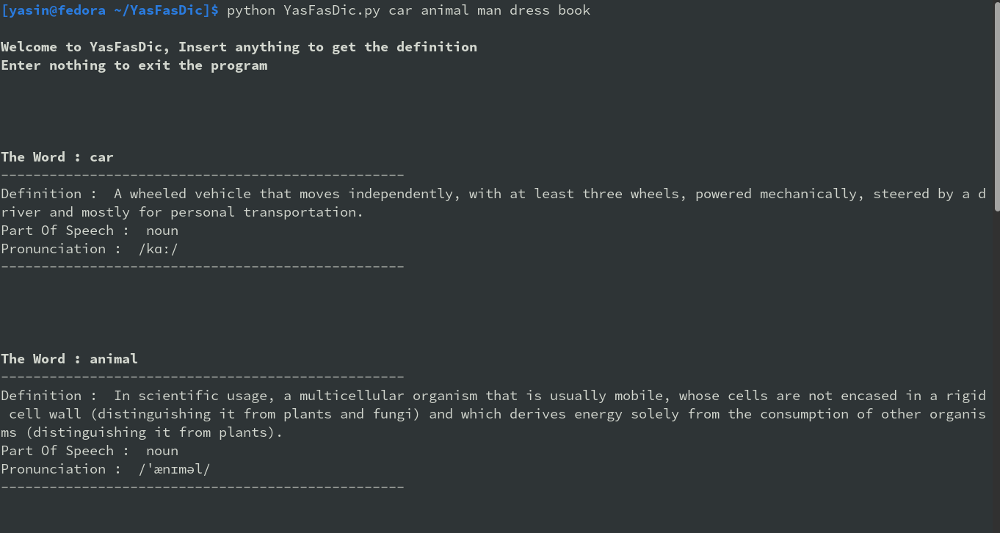

# YasFasDic
## A Script to get the definition, part of speech and phonetic of an English word, with the power of *RestFul API*, and the help of [Free Dictionary API](https://dictionaryapi.dev/) .
&nbsp;
# Using YasFasDic

##### *using YasFasDic in command line*

### like any other regular python file, you can run it directly in terminal/cmd **python YasFasDic.py**, it has an interactive interface, then it kindly asks you to enter a word or words, then serves you definition, part of speech and it's pronunciation.
&nbsp;

### you can also give the words as an argument for convenient, e.x ***python YasFasDic.py book car dress monkey***  **...**  .
&nbsp;
&nbsp;

## *Any contribute, help to improvement or add features would be valuable and appreciated.*